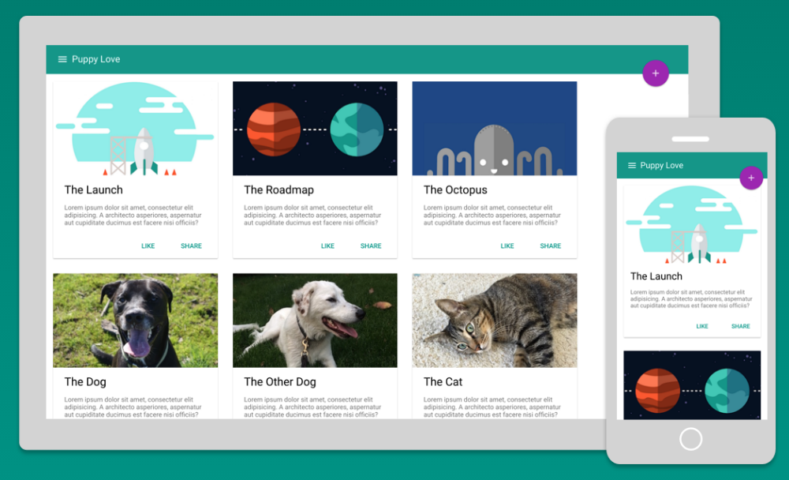
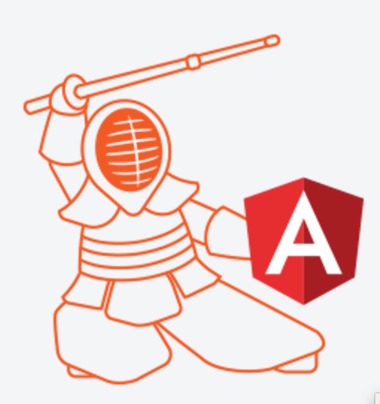
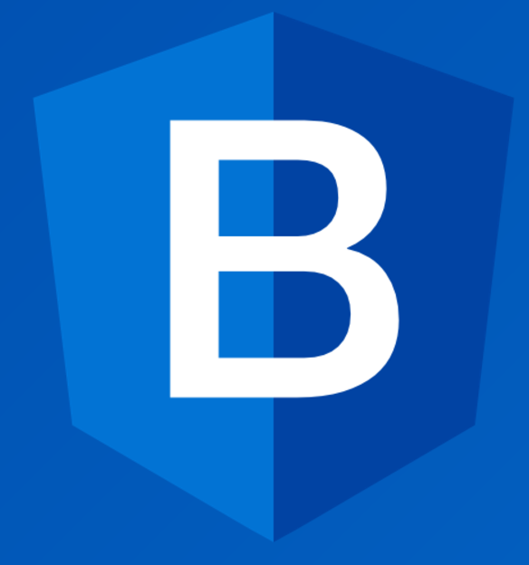

## Angular Meetup Basel

### Welcome


----

### Thank you Magnolia for the amazing room!


----

## Agenda

* Shoutouts announcements
* Presentations, demos
* Knowledge exchange
 * 15-20 minutes moderated
* Networking

----

## Code of Conduct

> From Washington DC: It's important.

* We are respectfull, tolerant and helpful.
* We are open to everyone interested in our topics.
* We want to promote and help open source.

---

## Shoutouts / News

* Jobs, Projects?
* Meetups, Events, Trainings?
* News?

----

## Angular 4 ?WTF?

* Angular 2, 3, 4, 5, 6
* Semantic Versioning
* Router v3 ==> Router v4 + Angular v4

----

## [Angular 2.1.x](http://angularjs.blogspot.ch/2016/10/angular-210-now-available.html)

* preloading of layzloaded modules
* animations improvements

----

## [Angular 2.2.x](http://angularjs.blogspot.ch/2016/11/angular-220-now-available.html)

* AOT support for @angular/upgrade - AngularJS 1.x upgrade
* Router improvements for upgrading
* Smaller AOT output (every version the filesize decreases)
* Guides for usage with ES5 (why?) and ES2015++

---

## Demo Ionic 2

* Please if you created anything - share it.

----

## Using json-server

> Backend in 5 minutes

```bash
npm -g install json-server
json-server -w somedata.json
http://localhost:3000/
```

---

# Open Knowledge exchange

* Integration with server
* UI Library, Component CSS, Global CSS
* ... ? topics ?

----

## Integration with server

* angular/http, observables (rxjs)
* websockets
* firebase
* pouchdb
* graphql
* ???

----

### UI/CSS Strategy: separate global css

```txt

src/styles.(css|sass|less)
  You could use basic Bootstrap + Custom styles.

[App] <tag class="some-class">
  |
  |_________
  |         |
[List]  [Detail] <tag class="some-class">

```

----

### UI/CSS Strategy: "rich" components

```txt

[App]
  ||
  ||____________________
  |          |          |
  |        [md-menu] [md-menu-item]{css}
  |
  |
  |--------[Detail]
  |         
[List]  
  |__________________________
          |                  |
       [md-list] <--- [md-list-item]{css}

```

----

Global-CSS | vs | Component-CSS
---|---|---
Common concept |  | New way
Easy to understand |  | Less Risk
Style focussed |  | Component focussed
Independant |  | Reusability
"Your Structure" |  | Technical Complexity
Template Developer |  | Frontend "Developer"

----

### UI Libraries







---

# Let's party :-)


