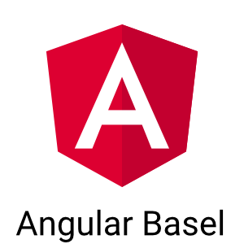

## Angular Meetup Basel

### Welcome



----

### Thank you Magnolia for the amazing room!


----

## Agenda

* Shoutouts, News, announcements
* Presentations, demos - Angular and Firebase
* Knowledge exchange, 15-20 minutes moderated
* Networking


----

## Shoutouts / News

* Jobs, Projects?
* Meetups, Events, Trainings?
* News?

----

## Meetup News

* [Check out About Page](https://www.meetup.com/Angular-Basel/about/)
* [Discussion Forum](https://www.meetup.com/Angular-Basel/messages/boards/thread/50557200)
* [T-Shirt Raffle](http://www.letsboot.com/meetup-raffle)

----

## Next Meetup

* Angular 2 and .Net Backend
* !! Please promote Meetup !!

----

## Universal-Cli

```bash
npm -g install universal-cli
ung new project --universal
cd project
npm start
```

> ung serve start dev mode, npm start starts universal

----

## Angular Community News

* [AngularJS == Angular 1, Angular == Angular 2,4,5...](http://angularjs.blogspot.ch/2017/01/branding-guidelines-for-angular-and.html)
* [Jazoon with Angular Event](http://jazoon.com/)


----

### [Angular 2.3.x](http://angularjs.blogspot.ch/2016/12/angular-230-now-available.html)

* [Angular Language Service - Template Completion](https://github.com/angular/vscode-ng-language-service)
* Components can inherit from another component
* Better error reporting - stack trace
* many fixes

### [Angular 2.4.x](http://angularjs.blogspot.ch/2016/12/angular-240-now-available.html)

* RxJS 5 dependency update$
* many fixes

---

## Demo - Angular + Firebase

* Please if you created anything - share it.

----

# Let's party :-)


