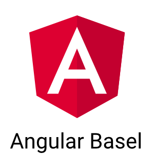

## Angular Meetup Basel

### Welcome

----

## Agenda

*   Shoutouts, News, announcements
*   Presentation => Angular 5
*   Networking

----

## Shoutouts / News

*   Jobs, Projects?
*   Meetups, Events, Trainings?
*   News?

----

## Conferences

*   ng-europe, February 1st/2nd in Paris <https://ngeurope.org>
*   ngVikings, March 1st/2nd in Helsinki <https://ngvikings.org>
*   AngularUP June 21st in Tel Aviv <http://angular-up.com>
*   AngularConnect November 6th/7th in London <https://www.angularconnect.com>

----

## New Trainings:

*   Blockchain by Mohamed 01.02.2018: <https://www.letsboot.com/blockchain>
*   Angular by Cedric Spindler 27.02.2018: <https://www.letsboot.com/angular>
*   React by Jonas Bandi 20.03.2018: <https://www.letsboot.com/react>
*   Full Stack Camp 2018: <https://www.letsboot.com/camp>
(It was a great success in 2017)

==> Discounts for all Angular Basel Meetup Members.

----

## Angular Slides:

<https://wingsuitist.github.io/angular-basel-meetup/index.html>

----

## Please share your insight

Wanted topics:

*   good examples / real live apps
*   Redux, ngrx/store
*   MEAN Stack
*   ngUpgrade
*   Lazy Loading / Routing
*   RxJS
*   Serverless AWS Lamda/Firebase
*   ... AOT, Material, Translations
*   Testing

---

## Agenda

*   quickly go through the changes
*   update helper
*   closer look at some topics

----

## What's new in Angular 5.0.0
<https://blog.angular.io/version-5-0-0-of-angular-now-available-37e414935ced>

----

### Performance
*   Build Optimizer
*   Compiler Improvements -> *ng serve --aot*
*   Zone speed improvements
*   *HttpClient*

----

### Feature improvements
*   Internationalized Number, Date, and Currency Pipes
*   Angular Universal State Transfer API and DOM Support
*   Angular Forms adds updateOn Blur / Submit

----

### Internals
*   Improved Decorator Support
*   Replace the ReflectiveInjector with StaticInjector
*   exportAs
*   New Router Lifecycle Events

----

### Dependencies
*   CLI v1.5
*   RxJS 5.5

----

## What's new in Angular 5.1.0
<https://blog.angular.io/angular-5-1-more-now-available-27d372f5eb4e>
*   Improved decorator error messages   
*   Angular Material & CDK Stable Release
*   CLI 1.6
    *   Service Worker Support
    *   Improved Universal & App Shell Support
*   TypeScript 2.5 support

----

## What's new in Angular 5.2.0
<https://blog.angular.io/angular-5-2-now-available-312d1099bd81>

*   Improved type checking for templates
*   Improved Router Param & Data Inheritance
*   TypeScript 2.6 support

----

## Angular 4.x -> Angular 5: Migration
<https://angular-update-guide.firebaseapp.com>

----

## Demo

*   HttpClient Module
*   Angular Template Syntax
*   i18n

----

## HttpClient
*   <https://blog.angular.io/version-5-0-0-of-angular-now-available-37e414935ced#5ee9>
*   Docs <https://angular.io/guide/http>

----

## i18n

*   Angular i18n Guide <https://angular.io/guide/i18n>
*   Angular CLI i18n Story <https://github.com/angular/angular-cli/wiki/stories-internationalization>
*   Angular CLI xi18n command manual <https://github.com/angular/angular-cli/wiki/xi18n>
*   Third party i18n support library <https://www.npmjs.com/package/ngx-i18nsupport>
*   XLF Translator: Github <https://github.com/martinroob/tiny-translator>
*   XLF Translator <https://martinroob.github.io/tiny-translator/en>

---

### Let's talk

<iframe src="https://giphy.com/embed/26ufbjVtvdCaikoP6" width="900" height="600" frameBorder="0" class="giphy-embed" allowFullScreen></iframe>
