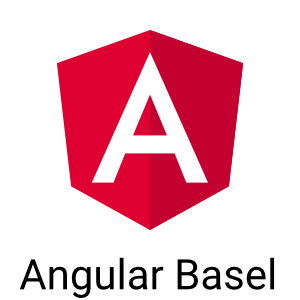

## Angular Meetup Basel

### Welcome

Note: Run slides using `sh present.sh` - npm install -g reveal-md if not available.

----

## Agenda

*   Shoutouts, News, announcements
*   Presentation => Angular Material
*   Networking

----

## Shoutouts / News

*   Jobs, Projects?
*   Meetups, Events, Trainings?
*   News?

----

## Angular Slides:

<https://wingsuitist.github.io/angular-basel-meetup/index.html>

----

## Please share your insight

Wanted topics:

*   good examples / real live apps
*   Redux, ngrx/store
*   MEAN Stack
*   ngUpgrade
*   Lazy Loading / Routing
*   RxJS
*   Serverless AWS Lamda/Firebase
*   ... AOT, Translations
*   Testing
*   How to integrate other libraries into Angular

---

## Agenda

*   Overview: what is Angular Material? What components does it provide?
*   How can the layout of components be changed?
*   How well do the components work over different browsers and devices?
*   Introduction to CDK

----

## Links
<https://material.angular.io/>
<https://material.angular.io/cdk/categories>
<https://blog.angular.io/a-component-dev-kit-for-angular-9f06e3b4b3b4>

---

### Let's talk

<iframe src="https://giphy.com/embed/26ufbjVtvdCaikoP6" width="900" height="600" frameBorder="0" class="giphy-embed" allowFullScreen></iframe>

----

## Charting Libraries
<https://www.primefaces.org/primeng/#/>
<https://js.devexpress.com/Overview/Charts/>
<https://www.highcharts.com/>

----

## IDE Support
<https://angular.io/guide/language-service>
<https://github.com/prettier/prettier>

----

## Books
<https://github.com/getify/You-Dont-Know-JS>
<https://www.ng-book.com/2/>

----

## Autentication
<http://www.passportjs.org/>
<https://auth0.com/>
